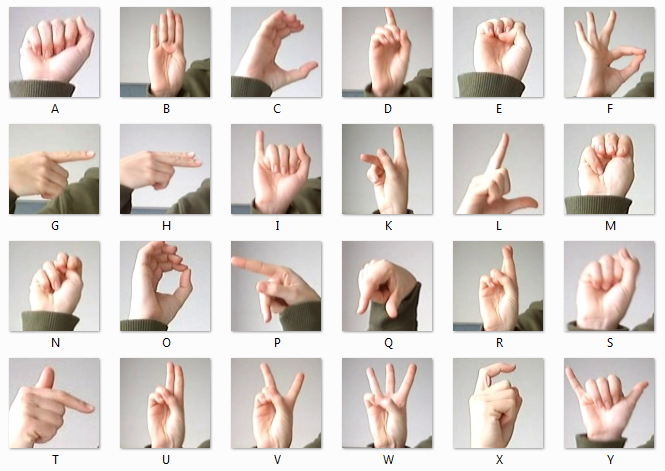
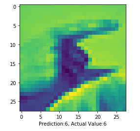

# EECS504 Project - ASL (Sign Language MNIST)

This project is based on `model.ipynb` and uses TensorFlow/Keras to classify ASL letters on the Sign Language MNIST dataset, with multi-model comparison and hyperparameter tuning.



## Project Contents

- Data: `data/sign_mnist_train.csv`, `data/sign_mnist_test.csv`
- Main experiment notebook: `model.ipynb`
- Trained model artifact: `sign_language_resnet_small.keras`
- Visualization examples: `model_summary.png`, `prediction_output.png`

## Environment Setup

Recommended: Python 3.9+

```bash
pip install tensorflow pandas numpy matplotlib seaborn scikit-learn opencv-python
```

## Training Configuration (from latest `model.ipynb`)

- Input shape: `28 x 28 x 1`
- Epochs: `8`
- Batch size: `128`
- Learning rate: `1e-3`
- Optimizer: `Adam`
- Loss: `sparse_categorical_crossentropy`
- Early stopping: `EarlyStopping(monitor='val_accuracy', patience=2, restore_best_weights=True)`

## Model Comparison Results (`results_df`)

| model | train_acc | val_acc | val_loss | params |
|---|---:|---:|---:|---:|
| resnet_small | 1.0000 | 0.9972 | 0.0137 | 681,529 |
| mobilenet_small | 0.9648 | 0.9794 | 0.0762 | 2,290,009 |
| vgg_tiny | 0.9808 | 0.9678 | 0.0703 | 142,073 |
| basic_cnn | 0.9887 | 0.9426 | 0.2010 | 243,481 |

Conclusion: the latest notebook selects `resnet_small` as the primary model and saves it as:

```text
sign_language_resnet_small.keras
```

## ResNet Tuning Results (`resnet_tune_df`)

Tuned parameters: `learning rate`, `batch size`, and `dropout`.

| setting | lr | batch_size | dropout | val_acc | best_val_acc |
|---|---:|---:|---:|---:|---:|
| small_batch | 1e-3 | 64 | 0.30 | 0.9985 | 1.0000 |
| base | 1e-3 | 128 | 0.30 | 0.9992 | 0.9992 |
| strong_dropout | 1e-3 | 128 | 0.45 | 0.9974 | 0.9974 |
| low_lr_small_batch | 3e-4 | 64 | 0.45 | 0.9968 | 0.9968 |
| low_lr | 3e-4 | 128 | 0.30 | 0.9877 | 0.9902 |

## Testing Summary (final notebook section)

- A confusion matrix is generated on the validation set.
- Real-image evaluation on a small sample in `data/photo` (10 images) reports:
  - `Dataset: 10 | Accuracy: 80.00%`

This indicates very strong in-distribution performance on Sign Language MNIST, while domain gap remains on real-world photos.

## How To Run

1. Open `model.ipynb`.
2. Run cells in order: data loading -> model comparison training -> best model saving -> confusion matrix -> real-image testing.
3. For inference-only usage, ensure `sign_language_resnet_small.keras` exists.

## Repository Cleanup Notes

- Removed: `.idea/`, `.ipynb_checkpoints/`
- Added: `.gitignore` (IDE files, notebook checkpoints, local data, and newly generated training artifacts)


